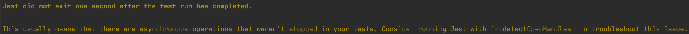

 앱이 종료되지 않은 상태에서 Jest가 종료되었음. 모든 테스트 케이스에 대해 (afterAll) app 종료 코드 추가
 ```tsx
beforeAll(async () => {
  const module: TestingModule = await Test.createTestingModule({
    imports: [AppModule],
  }).compile();

  app = module.createNestApplication();
  await app.init();
});
afterAll(() => app.close());
 ```